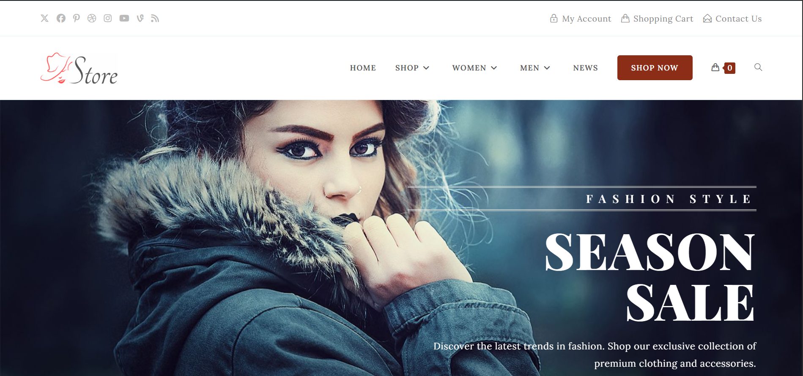
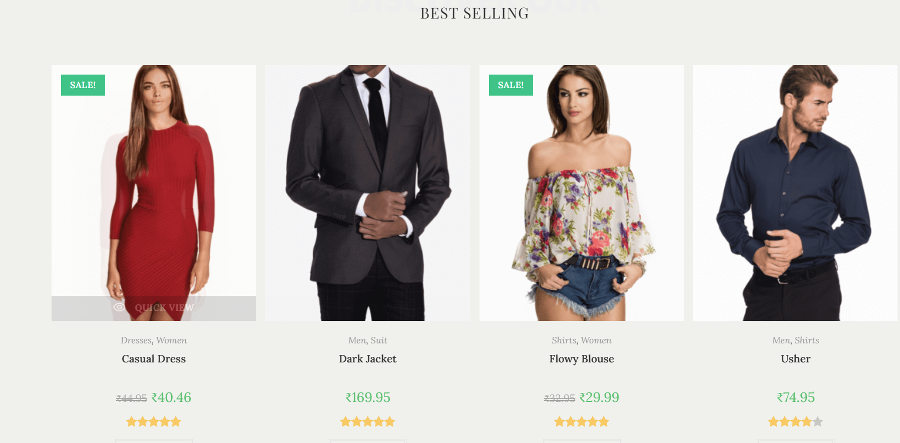
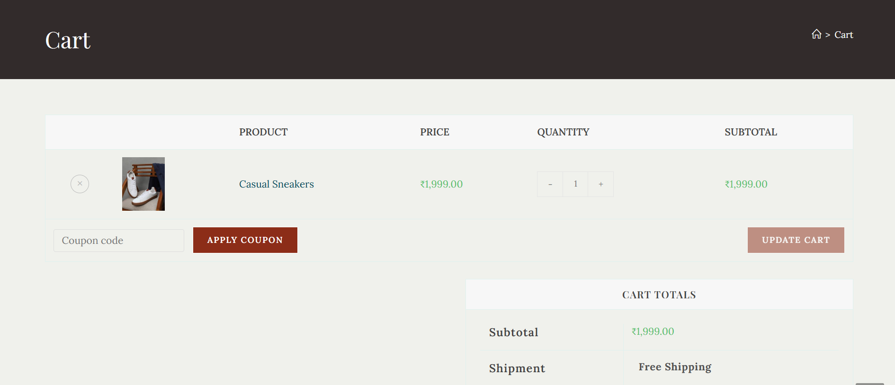
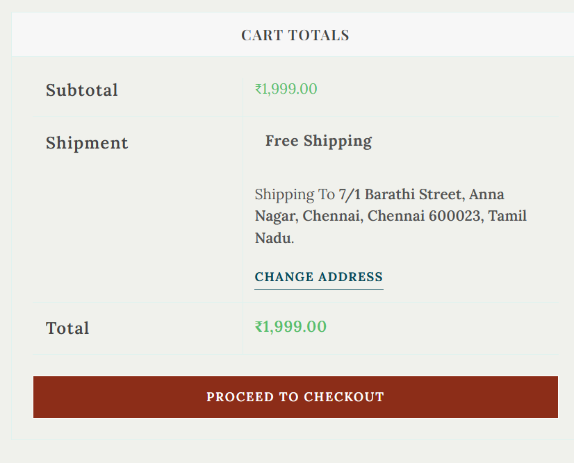
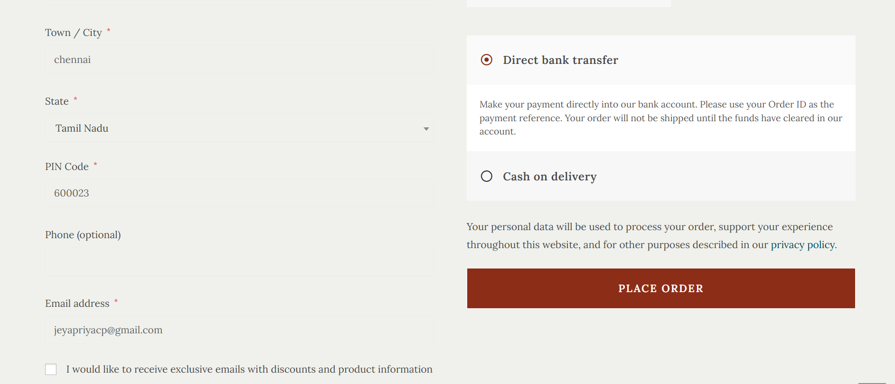
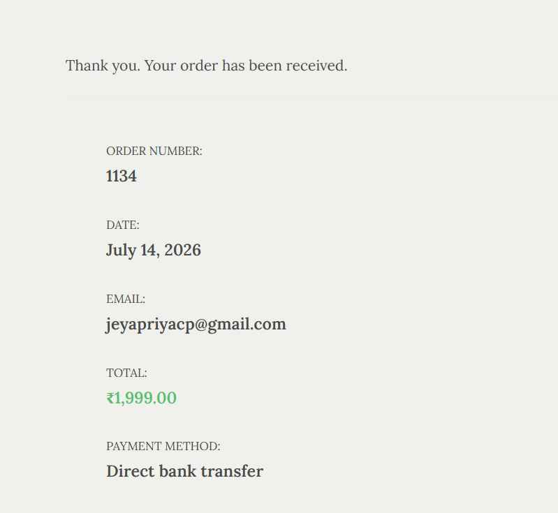

# Fashion Store - WooCommerce E-Commerce Website

A fully functional fashion e-commerce store built with WordPress and WooCommerce.

## 🛍️ Live Demo
> Built and tested on LocalWP (localhost)

## 🛠️ Tech Stack
- **CMS:** WordPress
- **E-Commerce:** WooCommerce
- **Theme:** OceanWP
- **Page Builder:** Elementor
- **Database:** MySQL
- **Language:** PHP

## ✨ Features
- Complete WooCommerce store setup
- Product management with categories
- Indian Rupee (₹) currency
- Cash on Delivery & Bank Transfer payments
- Free Shipping & Flat Rate shipping zones
- Responsive & mobile friendly design
- Men, Women & Accessories categories
- Sale badges & product ratings
- Cart & Checkout flow
- Order management dashboard

## 📸 Screenshots

### Homepage

### Best Selling Products

### Summer Collection Banner

### Women's Collection

### Single Product Page

### Shopping Cart

### Checkout & Billing

### Order Confirmation

### Complete Order Details

## ⚙️ Installation
1. Install WordPress locally using LocalWP
2. Import theme from wp-content/themes/oceanwp
3. Install WooCommerce plugin
4. Install Elementor plugin
5. Configure WooCommerce settings

## 👩‍💻 Developer
**Jeyapriya CP**
- GitHub: github.com/Priyapaulraj0014
- LinkedIn: linkedin.com/in/jeyapriyacp14
